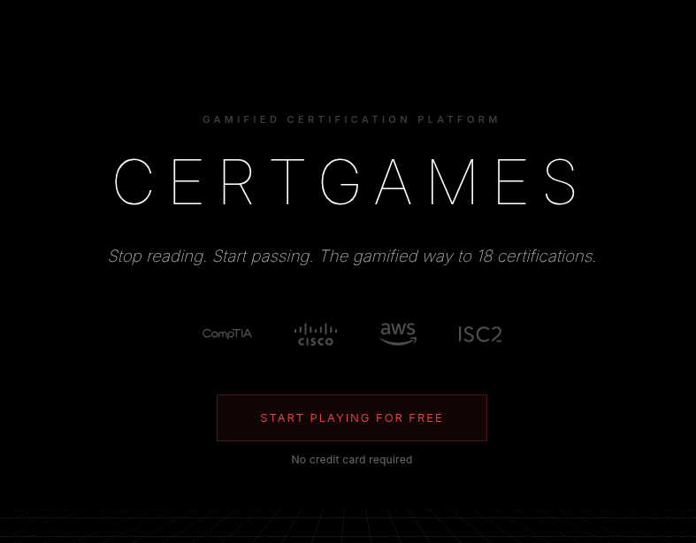

<!-- © AngelaMos | 2026 -->
<!-- README.md -->

  

  <h1>CompTIA SecAI+ Study Guide</h1>

  
The open-source companion to the daily TikTok series — breaking down every SecAI+ exam concept until you can pass.

  
  
  
  
  
  

---

## What is this?

CompTIA just released a brand new AI security certification — **SecAI+** — and there's barely anything out there on it yet.

This repo is the open study guide built alongside a **daily TikTok series** dropping one concept at a time. Every exam topic gets its own folder with a deep-dive breakdown and real-world examples — researched, written, and growing with each post.

Each concept folder includes:
- **`overview.md`** — in-depth breakdown: what it is, how it works, why it matters for the exam
- **`examples.md`** — real examples, attack patterns, sample prompts, and techniques

---

## Study Guide

### Domain 2 — Securing AI

| Concept | Overview | Examples | TikTok |
|---|---|---|---|
| AI Jailbreaking | [Read →](concepts/domain-2-securing-ai/ai-jailbreaking/overview.md) | [Examples →](concepts/domain-2-securing-ai/ai-jailbreaking/examples.md) | [Day 1](https://www.tiktok.com/@certgames.com/video/7613739701656145183) |
| Prompt Firewalls | [Read →](concepts/domain-2-securing-ai/prompt-firewalls/overview.md) | — | [Day 1](https://www.tiktok.com/@certgames.com/video/7613739701656145183) |
| Model Guardrails | [Read →](concepts/domain-2-securing-ai/model-guardrails/overview.md) | — | [Day 1](https://www.tiktok.com/@certgames.com/video/7613739701656145183) |

---

## All Domains

- [Domain 1 — AI Basics](concepts/domain-1-ai-basics/)
- [Domain 2 — Securing AI](concepts/domain-2-securing-ai/)
- [Domain 3 — AI-Assisted Security](concepts/domain-3-ai-assisted-security/)
- [Domain 4 — Governance & Compliance](concepts/domain-4-governance/)

---

**Built by [CertGames.com](https://certgames.com)**
 
*Stop reading. Start passing. The gamified way to 18 certifications.*

